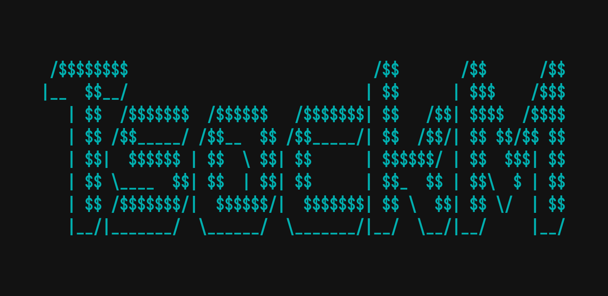

# TsockM

* The **LIGHTWEIGHT**, **FAST** and **PRIVACY FOCUSED** chatting program
    * p.s. communications are transmitted as plaintext 

## Prerequisits

* xorg-X11
    * `libX11-dlevel`
    * `libXcursor-dlevel`
    * `libXrandr-dlevel`
    * `libXinerama-dlevel`
* wayland
    * `wayland-dev` or `wayland-deval`

* OpenGL
    * `mesa-libGL-dlevel`

## Fedora 40 [RedHat]
* Install required libraries
```bash
sudo yum install wayland-devel.x86_64 libxkbcommon-devel.x86_64 mesa-libGL-devel.x86_64
```

## Quick Start
* Zig version at least `0.12.0`

* **SERVER**
```bash
zig build server -- <subcommand>
```
* **CLIENT**
```bash
zig build client -- <subcommand>
```

## Server

* The server portion of the application that handles communication between multiple client instances

### Protocol

* Communication between *server* and *client* is achived through the use of `TsockM.Protocol` 
* Protocol definition:
```
[type]::[action]::[status_code]::[sender_id]::[src]::[dst]::[body]
```
* `[type]` defines the protocol type:
    * `REQ`: request protocol
    * `RES`: response protocol
    * `ERR`: error protocol
* `[action]` defines the action the protocol is performing
    * `COMM`: establishing a communication socket
    * `COMM_END`: terminate the communication socket
    * `MSG`: message handling 
    * `GET_PEER`: when pinging a peer
    * `NTFY_KILL`: reporting termination of a peer
* `[status_code]` defines the status code of the program (based on HTTP status codes)
    * `OK`: 200
    * `BAD_REQUEST`: 400
    * `NOT_FOUND`: 404
    * `METHOD_NOT_ALLOWED`: 405,
    * `BAD_GATEWAY`: 502,
* `[sender_id]` defines some unsigned integer value
    * Used when communicating the `sender id` value
    * Used when communicating the `error code` of an *error protocol*
* `[src]` defines the source of the protocol
    * *TBA*
* `[dst]` defines the destination address of the protocol
    * *TBA*
* `[body]` text data
    * used for sending a variaty of plaintext(for now) data

### TODO

#### 0.4.0
* [ ] {FEAT} encrypt body of the protocol
* [ ] {FEAT} store messages
#### 0.3.3
* {TEST} `peer` tests
    * [ ] creation `init`
    * [ ] `peerRefFromId`
    * [ ] `peerRefFromUsername`
#### 0.3.2
* {TEST} `protocol` tests
    * [ ] creation `init`
    * [ ] convertion to string `asStr`
    * [ ] `fromStr`
    * [ ] `transmit`
    * [ ] `collect`
#### 0.3.1
* [ ] {UPDATE} `core.zig` rename to `server.zig`
* [ ] {UPDATE} make `Protocol` more robust with more functions and quality of life things
* [ ] {UPDATE} make `Peer` more robust with more functions and quality of life things
* [ ] {UPDATE} `Commander::Command::executor` generic type is not a ptr anymore
* [x] {FIX} report unknown argument
* [ ] {FEAT} ERROR protocol sent when peer was ping that does not exist
#### 0.3.0
* [x] {FEAT} Introduce server commands
* [x] {FEAT} Introduce server actions
* [x] {FEAT} `:mute` and `:unmute` server commands
#### 0.2.0
* [x] {FEAT} Server strcture
* [x] {FEAT} Consume program arguments:
    * `--log-level <level>` ... specify log level to be used
* [x] {UPDATE} introduce `thread_pool` 
* [x] {UPDATE} transform functions to be camel case as per zig standrad
* [x] {UPDATE} transform variables to be snake case as per zig standrad
* [x] {UPDATE} Unwrap Protocol structure file
* [x] {UPDATE} Unwrap Peer structure file
#### 0.2.x
* [ ] {BUG} notifying peer death does not work every time
* [ ] `peerFindUsernameMatch` find all peers with specific username
#### 0.1.0
* [x] send a notification to client when a peer gets terminated
* [x] Test message coloring
* [x] `:info` action for printing server stats (amount of peers connected, uptime, server-address, etc.)
* [x] `:ping <peer_username>` action for pinging the status of a peer
* [x] Thread shared data - Mutex and shared data between threads
* [x] Send periodic peer health check protocol ~ look for dead peers and remove them from the pool
* Executable commands on the server application
        * [x] `KILL <peer_id>` - removes a specific peer
        * [x] `KILL_ALL`       - removes all peers
        * [x] `LIST`           - prints relevant peer data
        * [x] `CC`             - Clear screen
* [x] Accept address as a variable when launching a server
* [x] Protocol should also contain `src` and `dest` IP addresses, socket form
* [x] Peer unique hash as ID 
* [x] Handle invalid *action* arguments
    * `KILL` - action must be provided with eather `<peer_id` or `all`, error otherwise 

## Client

* Application given to the user for chatting
    
### TODO

#### 0.5.x
* [ ] {FEAT} decrypt body of the protocol
* [ ] {UPADTE} removed depricated code
* [ ] {FEAT} custom messeging commands like `\c{RED};HELLO\` that applies special properties to text
    * `\b;HELLO\` prints bold text
    * `\u;HELLO\` prints underlined text
    * `\c{#00FFAA};HELLO\` prints colored text based on hex value 
* [ ] {FEAT} Multicolor support for message display
* [ ] {UPDATE} don't crash the the client wait for a connection to the server be available
* {FEAT} Client commands
    * [ ] `:ping` ~ ping user by username and print user info
#### 0.4.1
* [x] {UPDATE} make `Action` and `Command` a shared library between server and client src code
* [x] {UPDATE} finish implementaton of `:exit` action ~ handle COMM_END response
#### 0.4.x
* [x] {FEAT} popups for warnings and errors
* [x] {FEAT} clipboard paste support
* {FEAT} `ClientScreen` ~ groups of related render/functionality code
    * [x] `LoginScreen`
    * [x] `MessagingScreen`
#### 0.3.0
* [x] {FEAT} print client termination
* {FEAT} Introduce `ClientActions`
    * [x] bad-request-action
    * [x] comm-action
    * [x] comm-end-action
    * [x] get-peer-action
    * [x] msg-action
    * [x] ntfy-kill-action
* [x] {FEAT} Introduce `ClientCommands`
#### 0.2.2
* [x] {FIX} when exiting duuring `connection succesful` the program deadlocks
* [x] {FEAT} consume `-fp` for setting location to the font 
* [x] {FEAT} consume `-F` start parameter to set scaling factor of the window
* [x] set client address source when sending things to the server
#### 0.2.x
* [x] {FEAT} read server adddress as program argument
#### 0.1.0
* [x] Consume peer termination notification and print it on screen
* [x] Test message coloring
* [x] Accept address as a variable when connecting a server
* [x] Use **Mutex** to share `should_exit` state between `read_cmd` and `listen_for_comms`
* [x] `:info` command to print information about the client instance

---

# References

* SQIDS: https://github.com/sqids/sqids-zig
* Raylib.zig: https://github.com/Not-Nik/raylib-zig
